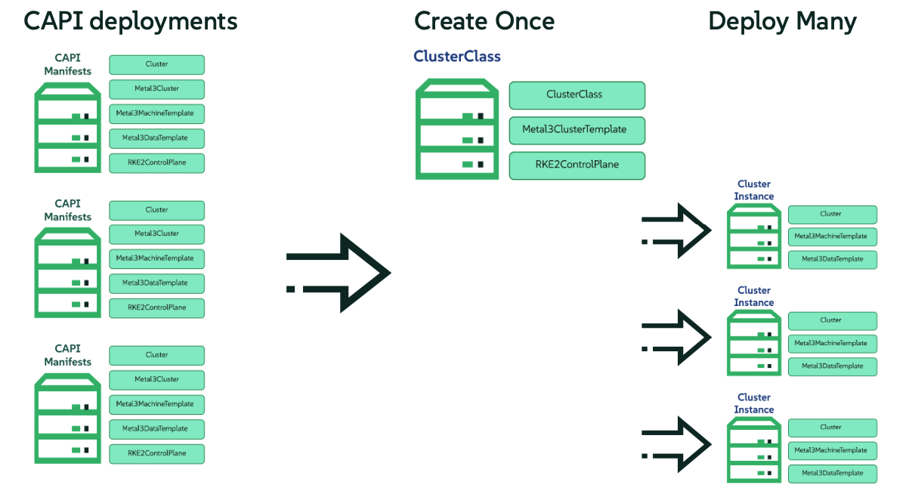

# Example of ClusterClass with some examples to deploy clusters

## Introduction
Traditional CAPI involves defining each cluster component individually, leading to verbose and often repetitive YAML configurations. While powerful, this approach can become cumbersome, especially when managing multiple clusters with similar configurations. 
The sheer volume of configuration files makes maintenance challenging, increasing the risk of errors and inconsistencies.

ClusterClass addresses these challenges by introducing a template-driven model for cluster creation. Instead of defining each component from scratch, users define a ClusterClass, which serves as a blueprint for creating multiple clusters. 
This abstraction significantly reduces the amount of configuration required, leading to cleaner and more manageable deployments.

## ClusterClass Definition

The `clusterclass.yaml` file contains the definition of the cluster class. The idea is to encapsulate the complexity of the cluster configuration into a single object, making it easier to manage and deploy clusters using instances files.
It includes the following key components:
- **ClusterClass**: The main object that defines the cluster class.
- **ControlPlane**: Defines the control plane configuration (RKE2ControlPlaneTemplate), including the number of replicas and the image to be used.
- **InfrastructureTemplate**: Defines the infrastructure configuration (Metal3ClusterTemplate), including the template for the underlying infrastructure (metal3 in this case).
- **Patches**: Allows for customization of the cluster class by applying patches to the control plane and infrastructure templates.

## Cluster Instances

The `cluster-instance1.yaml` and `cluster-instance2.yaml` files contain the instances of the cluster class. Each instance represents a specific cluster configuration, allowing for easy deployment of multiple clusters with similar configurations.

The instances include the following key components:

- **Cluster**: The main object that defines the cluster instance. There are some important components here:
  - **Topology/class**: The name of the cluster class to be used for this instance.
  - **Topology/version**: The version of the cluster class to be used for this instance.
  - **Topology/variables**: Allows for customization of the cluster instance by applying patches to the control plane and infrastructure templates. This is the instantiation of the cluster class.

- **Metal3MachineTemplate**: Defines the machine template for the cluster instance, including the image to be used and the host selector to identify the target baremetal hosts.
- **Metal3DataTemplate**: Defines the data template for the cluster instance.

For each instance file, you have to replace the following values:

- `${RKE2_VERSION}`: The version of RKE2 to be installed in the edge cluster.
- `${CONTROL_PLANE_ENDPOINT_HOST}`: The IP address to be used as an endpoint for the edge cluster.

**NOTE**: If you want to add more variables to be applied in each instance cluster, you will need to modify the values here to customize for your cluster instance.